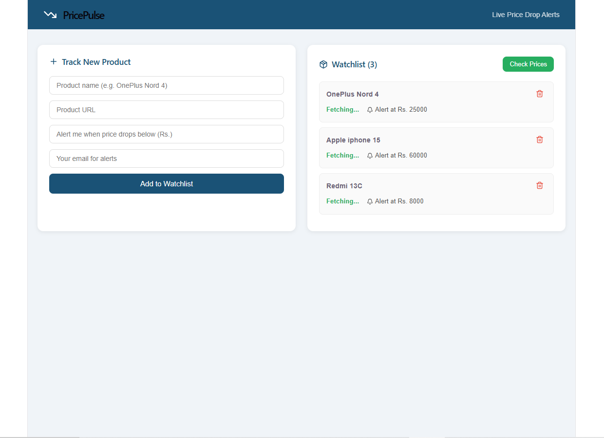
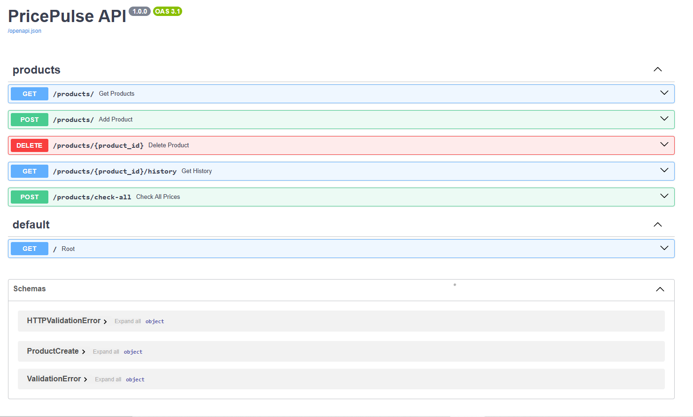

# PricePulse 🔔
### Automated Product Price Drop Alerting System

> Track any product, set your price target, get alerted instantly when it drops.




---

## What is PricePulse?

PricePulse is a full-stack web application that monitors product prices across 
e-commerce platforms. Users add product URLs to their watchlist, set an alert 
threshold, and receive a formatted HTML email the moment the price drops below 
their target.

---

## Features

- Real-time price tracking — scrapes live product pages on demand
- Smart email alerts — triggers only when price crosses threshold, no spam
- Price history chart — visualize price trends over time
- Multi-user watchlist — each product tracked with individual alert email
- REST API — fully documented with Swagger UI at `/docs`
- Serverless ready — designed for AWS Lambda + EventBridge deployment

---

## Tech Stack

-- Layer | Technology |
--   |

--Backend | Python 3.13, FastAPI, SQLAlchemy |
-- Database | SQLite (local) / PostgreSQL (production) |
-- Scraping | BeautifulSoup4, Requests |
-- Email Alerts | Python SMTP (Gmail) |
-- Frontend | React.js, Vite, Recharts, Axios |
-- Deployment | AWS Lambda, API Gateway, S3 + CloudFront |

---

## Screenshots

### Dashboard


### API Documentation


---

## Getting Started

### Prerequisites
- Python 3.10+
- Node.js 18+
- Git

### 1. Clone the repository
```bash
git clone https://github.com/Sushma-Dev-code/price-pulse.git
cd price-pulse
```

### 2. Backend Setup
```bash
cd backend
pip install -r requirements.txt
cp .env.example .env
```

Edit `.env` file:

DATABASE_URL=sqlite:///./pricepulse.db
ALERT_EMAIL=your-gmail@gmail.com
ALERT_PASSWORD=your-gmail-app-password

Run the backend:
```bash
python -m uvicorn app.main:app --reload
```

- API → http://localhost:8000
- Swagger docs → http://localhost:8000/docs

### 3. Frontend Setup
```bash
cd frontend
npm install
npm run dev
```

- App → http://localhost:5173

---

## API Endpoints

| Method | Endpoint | Description |
|---|---|---|
| GET | `/products/` | Get all tracked products |
| POST | `/products/` | Add new product to watchlist |
| DELETE | `/products/{id}` | Remove product |
| GET | `/products/{id}/history` | Get price history |
| POST | `/products/check-all` | Trigger price check + send alerts |

---

## How It Works
User adds product URL + threshold
↓
Backend scrapes live price (BeautifulSoup)
↓
Price saved to database (SQLAlchemy + SQLite)
↓
Check Prices triggered (manual / AWS Lambda scheduled)
↓
If price drops below threshold → HTML email alert sent
↓
Price history updated → Chart rendered on frontend

---

## Project Structure
price-pulse/
├── backend/
│   ├── app/
│   │   ├── main.py          # FastAPI entry point
│   │   ├── database.py      # SQLAlchemy models + DB setup
│   │   ├── scraper.py       # BeautifulSoup price scraper
│   │   ├── alerter.py       # SMTP email alert system
│   │   └── routes/
│   │       └── products.py  # All API endpoints
│   └── requirements.txt
├── frontend/
│   └── src/
│       └── App.jsx          # React dashboard
├── screenshots/
└── README.md

---

## Author

**Sushma S** — Full Stack Developer
- GitHub: [@Sushma-Dev-code](https://github.com/Sushma-Dev-code)
- LinkedIn: [linkedin.com/in/sushma-s-607194338](https://linkedin.com/in/sushma-s-607194338)
- Email: sushma.s0682@gmail.

⭐ Star this repo if you found it useful!

